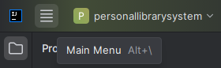
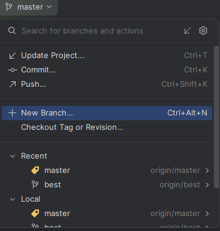
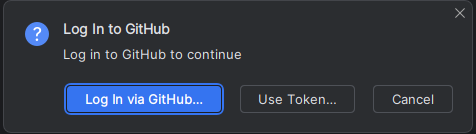
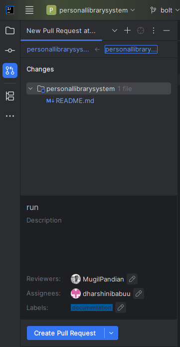

### GITHUB
- Repository(eg:personallibrarysystem)
- Click on the CODE block
- Dhoose HTTPS
- COPY url to clipboard

### Intellij IDE
-Main menu(Hamburger button)

### File
- New
- project from version control...

### Clone Repository
- URL:(PASTE the url copied to clipboard)
- Clone

### Branch Creation
- master
- New Branch

- Name the branch(shouldn't be a keyword)  
- Create

### To make Changes
- README.md file will open else open it from the folder
- Editor button

- Make a Change

### To Commit
- commit button
- README.md

- Tick on the checkbox
- Type description of our choice
- Commit and Push

### Uploading the Changes to the Repository
- Push

- Log in via GitHub...

- Authorize in GitHub

### To Create Pull request
- Create Pull request

- Edit Reviewers,Assigners,Labels
- Create Pull request(sent for review to the Reviewers)

